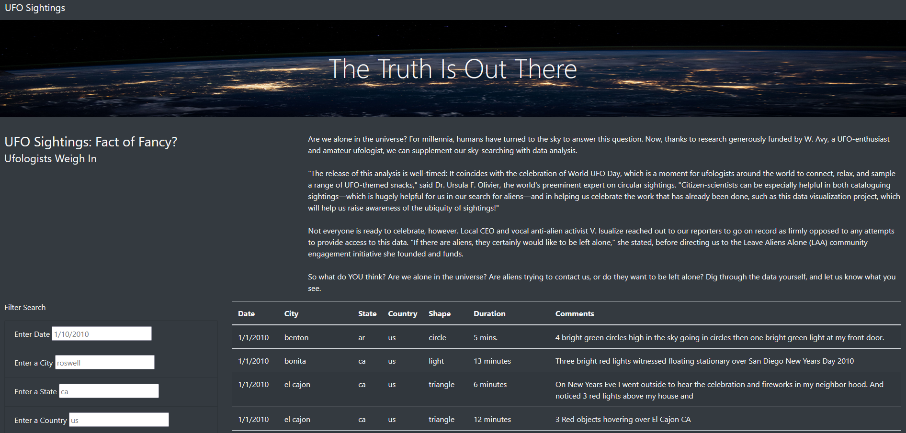
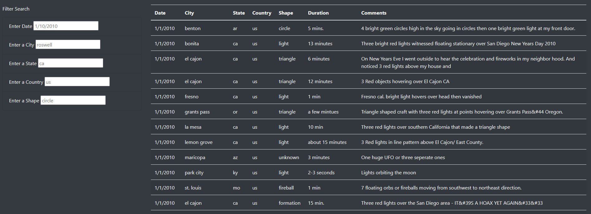
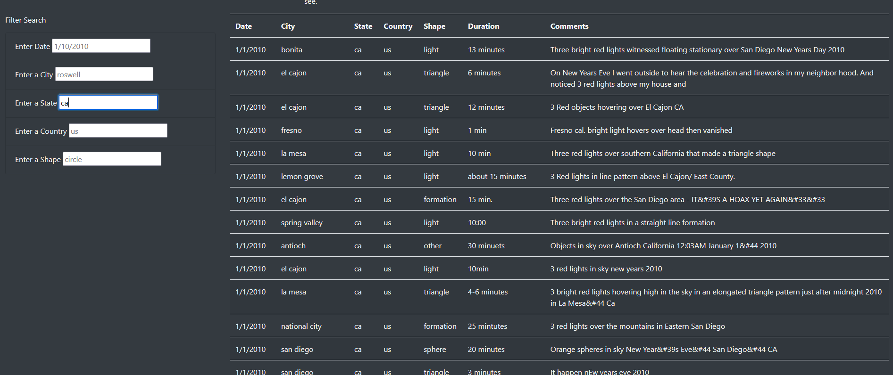
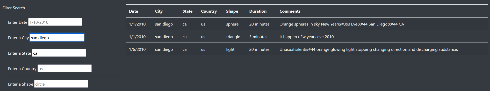

# Mission-To-Mars

### Overview of the Analysis

The purpose of this analysis was to provide a more in-depth analysis of UFO sightings by allowing users to filter for multiple criteria at the same time, such as:

1. Date
2. City
3. State
4. Country
5. Shape

### Results

1. When a user visits the webpage, this is the image they will see.

2. We were able to update the webpage which allows the user to filter the table by all 5 criteria.

3. For example, if the user wanted to filter the data for UFO sightings in the State of California, these are the results they would see. As you can see, there is still a lot of data.

The beauty of the webpage is that since we updated it, the user can use multiple filters. For example, they can filter the data for UFO sightings in the city of San Diego, which helps reduce the data down to 3 instances.

### Summary

1. A major drawback of this design is that if the user inputs criteria for the filter that does not exactly match what is in the table, they get no results.
2. My first recommendation would be gathering more data so that the user has access to more information.
2. My second recommendation would be adding links to images, videos, interviews, and/or articles for each sighting so that the information may have some form of validity.